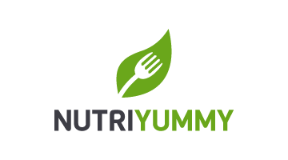
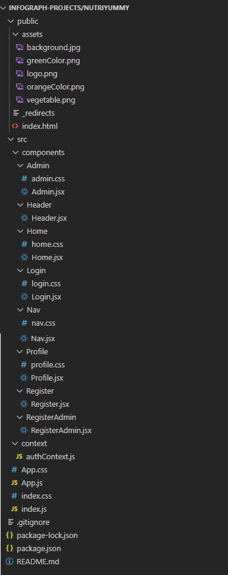
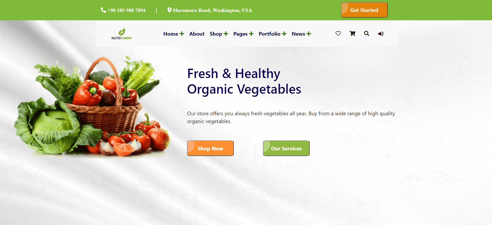

# NUTRIYUMMY

## Index

- [Development of the App](Development-of-the-App)
  - [Backend](https://github.com/InfoGraph-Projects/nutriyummy/tree/backend)
  - [Frontend](https://github.com/InfoGraph-Projects/nutriyummy/tree/frontend)
- [NUTRIYUMMY](#NUTRIYUMMY)
  - [Business Requirements](#Business-Requirements)
  - [Technical Requirements](#Technical-Requirements)
  - [Application Structure](#Application-Structure)
  - [How to use the App](#How-to-use-the-App)
  - [More about the App](#More-about-the-App)
- [Author Links](#Author-Links)
- [Deployment link 🌍](https://nutriyummy.netlify.app/)

---

# NUTRIYUMMY

A company called “NUTRIYUMMY” that making organic meals is looking to create a complaint
management system.

## Business Requirements

Users will be able to register, login, send a complaint and check the status of the
complaint. Admins should login and see all complaints.

### Technical Requirements

The application will be created with the following overall architecture and methodologies

1. Create user registration and login pages. Please note that there are 2 different kinds of registrations
   (admin and customer).
1. A form to send a complaint to the backend system. The logged in user should be able to view the status
   of their complaints, whether they are resolved, pending resolution or dismissed. Please include different
   types of fields when build the form, such as multi-select pick list, text areas, checkboxes, etc.
1. An admin page to view all the complaints and change the status of the complaint. A chart that
   represents the number of the complaints based on their types.

### Application Structure

### How to use the App

  

---

### **More about the App**

- #### Author

  - Shady Khaled

  **[⬆ Back to Index](#index)**

- #### Github

  - For the repo **_nutriyummy_** clicks => [here](https://github.com/InfoGraph-Projects/nutriyummy).

  **[⬆ Back to Index](#index)**

- #### App

  - To run 🏃 the app ⬇️:
    - clone the repo / frontend branch or backend branch
    - run npm i / npm install
    - run `npm start`
    - Deployment link 🌍: [storefront](https://nutriyummy.netlify.app/)

- This app done with help of

  - dependencies
    - react
    - react-dom
    - react-scripts
    - react-router
    - react-router-dom
    - react-chartjs-2
    - react-bootstrap
    - axios
    - moment
  - framework
    - Express
    - React
  - tools
    - Node js.
    - Github.
    - Netlify.
    - Heroku.
    - VsCode.
    - Ubuntu.
    - ZSH.
  - with help from:
    - CodeFellows
    - W3School

  **[⬆ Back to Index](#index)**

 

---

 

## Author Links

- ### Shady Khaled github ✅

  - [Shady Khaled](https://github.com/shadykh)

- ### Shady Khaled portfolio 💬

  - [Shady Khaled portfolio](https://shady-portfolio.netlify.app/)
